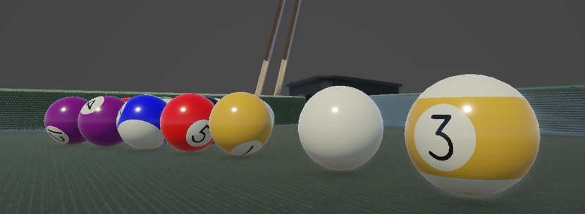

# Procedural Pool Ball

Procedurally draw pool balls in a shader (stripe, number, etc.).

## Overview

Under the hood, this shader uses Signed Distance Fields (SDF) to procedurally draw the stripe, the background circle, and the number itself. Shader properties can be tweaked to achieve the desired look, for example the stripe color can be changed or entirely turned off. The numbers are drawn as SDF font, which means a font texture is required (example is provided in repo).

By default, the shader is configured to support a 4x4 grid of numbers (from 0 to 15). This can be adjusted if additional numbers are needed or if custom textures are used.

## Specs

- Unity: **6000.3.10f1**
- Render Pipeline: **Universal Render Pipeline (URP)**

## License

Licensed under MIT unless otherwise specified - see [LICENSE](LICENSE) for more information.

## Acknowledgements

Kenney - Prototype Textures -
https://www.kenney.nl/assets/prototype-textures

Mark Peters - Pool Table - 
https://skfb.ly/pEBFO

Ben Cloward - Sharp Text Shader - 
https://youtu.be/Euvy_R03rlg?si=JTv5Y-RpnsN2R5GH